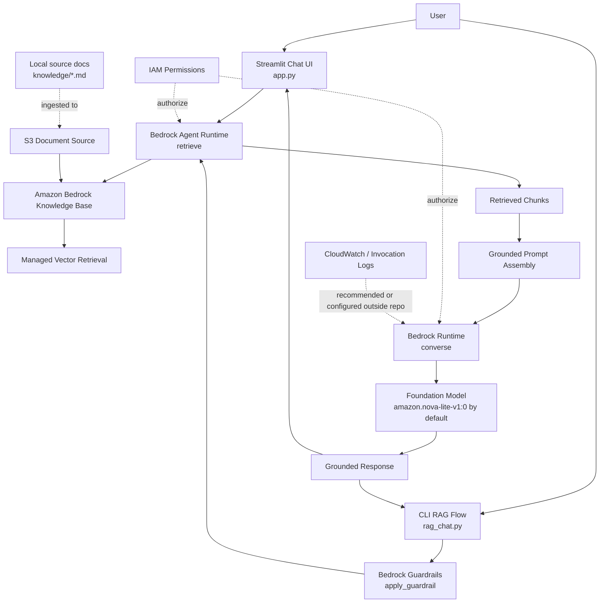
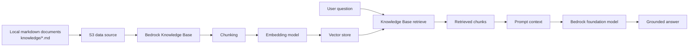

# AWS Bedrock Enterprise Generative AI & RAG Proof of Concept

This repository documents and implements a local proof of concept for an enterprise-style Generative AI assistant using Amazon Bedrock, Python, Boto3, Amazon Bedrock Knowledge Bases, Bedrock Guardrails, and Streamlit.

The PoC demonstrates a retrieval-augmented generation workflow where a user asks questions about internal architecture standards, relevant document chunks are retrieved from a Bedrock Knowledge Base, and a Bedrock foundation model generates a grounded response.

This is a PoC reference implementation, not a production-ready deployment.

## PoC Objectives

| Objective | Status | Evidence |
|---|---|---|
| Invoke an Amazon Bedrock foundation model from Python | Implemented | `test_bedrock.py` uses `bedrock-runtime.converse` |
| Build a RAG workflow over enterprise reference documents | Implemented | `retrieve.py`, `rag_chat.py`, and `app.py` use Knowledge Base retrieval |
| Ground answers in enterprise architecture standards | Implemented | `knowledge/*.md` contains source material |
| Build a Streamlit chat interface | Implemented | `app.py` provides a chat UI |
| Test Streamlit independently | Implemented | `test_streamlit.py` validates local UI startup |
| Apply Bedrock Guardrails to user input | Implemented in CLI flow | `guardrail_test.py` and `rag_chat.py` call `apply_guardrail` |
| Capture model token usage and latency | Implemented for direct model test | `test_bedrock.py` prints usage and latency |
| Configure Bedrock model invocation logging | Not evidenced in repository | `<TO_BE_CONFIRMED>` |
| Explore Bedrock Agents or tool calling | Not implemented during this PoC | No agent implementation found |
| Deploy to AWS-hosted runtime | Not implemented during this PoC | Local Python/Streamlit execution only |

## Architecture



| Component | Purpose | Status |
|---|---|---|
| Streamlit | Local chat interface for asking architecture-standard questions | Implemented |
| Python / Boto3 | Application code and AWS SDK integration | Implemented |
| Amazon Bedrock Runtime | Foundation model invocation through `converse` | Implemented |
| Bedrock Agent Runtime | Knowledge Base retrieval through `retrieve` | Implemented |
| Amazon Bedrock Knowledge Base | Managed retrieval over ingested enterprise documents | Implemented, external AWS config not included |
| Local knowledge documents | Source markdown files for architecture, API security, and microservice standards | Implemented |
| Amazon S3 | Expected document source for Knowledge Base ingestion | Required by architecture, bucket details not included |
| Embeddings / vector store | Managed by Bedrock Knowledge Bases | Configured outside repository; details `<TO_BE_CONFIRMED>` |
| Bedrock Guardrails | Input safety check before RAG in CLI flow | Implemented in `rag_chat.py` and `guardrail_test.py` |
| IAM | AWS access control for Bedrock and Knowledge Base APIs | Required; policy artifacts not included |
| CloudWatch / model invocation logging | Observability for model calls, errors, token usage, and audit | Not evidenced in repository |

## Request Flow

### Streamlit Flow

1. User opens the Streamlit application from `app.py`.
2. User enters a question in `st.chat_input`.
3. The app creates Boto3 clients for:
   - `bedrock-agent-runtime`
   - `bedrock-runtime`
4. The question is sent to the Bedrock Knowledge Base with `retrieve`.
5. Up to five retrieved chunks are extracted from `retrievalResults`.
6. The app builds a prompt instructing the model to answer only from the retrieved context.
7. The prompt is sent to the configured foundation model with `bedrock-runtime.converse`.
8. The model response is displayed in Streamlit and stored in `st.session_state.messages`.
9. If an exception occurs, Streamlit displays `AWS Bedrock error: <error>`.

### CLI Guardrail + RAG Flow

1. User enters a question in `rag_chat.py`.
2. The question is evaluated with `bedrock-runtime.apply_guardrail`.
3. If the guardrail action is `GUARDRAIL_INTERVENED`, the request is blocked.
4. If allowed, the question is sent to the Knowledge Base using `retrieve`.
5. Retrieved chunks are formatted as numbered sources.
6. A grounded prompt is sent to the foundation model with `converse`.
7. The answer and retrieved source locations are printed to the terminal.

## AWS Services Used

| AWS Service | Role in PoC | Status |
|---|---|---|
| Amazon Bedrock | Managed foundation model access | Implemented |
| Bedrock Runtime API | Model invocation through `converse` and guardrail checks through `apply_guardrail` | Implemented |
| Bedrock Knowledge Bases | Semantic retrieval over enterprise documents | Implemented |
| Bedrock Agent Runtime API | Knowledge Base retrieval through `retrieve` | Implemented |
| Bedrock Guardrails | Input safety evaluation | Implemented in CLI scripts |
| Amazon S3 | Expected source document location for Knowledge Base ingestion | Required, exact bucket not supplied |
| IAM | Permissions for Bedrock, Knowledge Base retrieval, and optional logging | Required, policy not supplied |
| CloudWatch Logs | Intended model invocation and operational logging | `<TO_BE_CONFIRMED>` |

## Repository Structure

```text
bedrock-poc/
|-- app.py
|-- guardrail_test.py
|-- knowledge/
|   |-- api-security.md
|   |-- integration-standard.md
|   `-- microservice-standard.md
|-- rag_chat.py
|-- README.md
|-- requirements.txt
|-- retrieve.py
|-- test_bedrock.py
`-- test_streamlit.py
```

| File | Responsibility |
|---|---|
| `app.py` | Main Streamlit chat application using Knowledge Base retrieval plus Bedrock model generation |
| `rag_chat.py` | CLI RAG workflow with Guardrails input check, retrieval, prompt assembly, answer generation, and source printing |
| `retrieve.py` | Focused Knowledge Base retrieval test for the question: `What authentication standard should external APIs use?` |
| `guardrail_test.py` | Interactive CLI script for testing `apply_guardrail` behavior |
| `test_bedrock.py` | Direct Bedrock model invocation test using `amazon.nova-lite-v1:0`; prints token usage and latency |
| `test_streamlit.py` | Minimal Streamlit health-check app |
| `knowledge/*.md` | Enterprise architecture standards used as RAG source material |
| `requirements.txt` | Present but currently empty; dependencies are inferred from imports |
| `.env` | Local environment configuration; must not be committed to GitHub |

## Prerequisites

- AWS account with Amazon Bedrock enabled in the target region.
- Access granted to the selected foundation model.
- Python 3.10+ recommended. The local virtual environment in this workspace uses Python 3.13, but the code does not require Python 3.13-specific features.
- AWS CLI installed for credential setup and verification.
- IAM permissions for Bedrock Runtime, Bedrock Knowledge Base retrieval, Guardrails, and any supporting S3 or CloudWatch configuration.
- A Bedrock Knowledge Base created and synchronized from the enterprise documents.
- Source documents uploaded to the configured Knowledge Base data source, typically S3.
- Local Python packages:
  - `boto3`
  - `streamlit`
  - `python-dotenv`

## AWS Authentication Setup

For local development, configure AWS credentials using the AWS CLI:

```bash
aws configure
```

Verify the caller identity before running the PoC:

```bash
aws sts get-caller-identity
```

For local development, named profiles or temporary SSO credentials are preferred over long-lived access keys. For AWS-hosted workloads, use IAM roles attached to the runtime environment, such as ECS task roles, Lambda execution roles, EC2 instance profiles, or EKS IAM Roles for Service Accounts.

Never commit AWS access keys, secret keys, `.env` files containing credentials, or temporary session tokens to GitHub.

## IAM Configuration

The repository does not include the actual IAM policy used during the PoC. The following example shows the minimum permission categories implied by the code. Replace placeholders with least-privilege ARNs for the actual account, region, Knowledge Base, model, guardrail, S3 bucket, and log group.

```json
{
  "Version": "2012-10-17",
  "Statement": [
    {
      "Sid": "InvokeBedrockModel",
      "Effect": "Allow",
      "Action": [
        "bedrock:InvokeModel",
        "bedrock:InvokeModelWithResponseStream"
      ],
      "Resource": [
        "arn:aws:bedrock:<AWS_REGION>::foundation-model/<MODEL_ID>"
      ]
    },
    {
      "Sid": "UseKnowledgeBaseRetrieval",
      "Effect": "Allow",
      "Action": [
        "bedrock:Retrieve",
        "bedrock:RetrieveAndGenerate"
      ],
      "Resource": [
        "arn:aws:bedrock:<AWS_REGION>:<AWS_ACCOUNT_ID>:knowledge-base/<KNOWLEDGE_BASE_ID>"
      ]
    },
    {
      "Sid": "ApplyGuardrail",
      "Effect": "Allow",
      "Action": [
        "bedrock:ApplyGuardrail"
      ],
      "Resource": [
        "arn:aws:bedrock:<AWS_REGION>:<AWS_ACCOUNT_ID>:guardrail/<GUARDRAIL_ID>"
      ]
    },
    {
      "Sid": "ReadKnowledgeSourceDocuments",
      "Effect": "Allow",
      "Action": [
        "s3:GetObject",
        "s3:ListBucket"
      ],
      "Resource": [
        "arn:aws:s3:::<KNOWLEDGE_SOURCE_BUCKET>",
        "arn:aws:s3:::<KNOWLEDGE_SOURCE_BUCKET>/*"
      ]
    },
    {
      "Sid": "WriteModelInvocationLogsIfEnabled",
      "Effect": "Allow",
      "Action": [
        "logs:CreateLogGroup",
        "logs:CreateLogStream",
        "logs:PutLogEvents"
      ],
      "Resource": [
        "arn:aws:logs:<AWS_REGION>:<AWS_ACCOUNT_ID>:log-group:<BEDROCK_LOG_GROUP>:*"
      ]
    }
  ]
}
```

Notes:

- The code uses `retrieve`, not `retrieve_and_generate`, in the current implementation.
- `RetrieveAndGenerate` is included above only if that API is later added.
- Scope foundation model permissions to the specific model IDs used by the application.
- Scope Knowledge Base permissions to the specific Knowledge Base ARN.
- Do not use `Resource: "*"` for production workloads unless an AWS service limitation requires it and the risk has been reviewed.

## Environment Configuration

The code loads configuration from `.env` using `python-dotenv`.

Required variables:

```env
AWS_REGION=<aws-region>
***REMOVED***<bedrock-knowledge-base-id>
***REMOVED***<bedrock-foundation-model-id>
***REMOVED***<bedrock-guardrail-id>
GUARDRAIL_VERSION=<guardrail-version>
```

Observed behavior:

- `app.py` defaults `AWS_REGION` to `us-east-1` if it is not set.
- `app.py` defaults `MODEL_ID` to `amazon.nova-lite-v1:0` if it is not set.
- `rag_chat.py`, `retrieve.py`, and `guardrail_test.py` expect the relevant values to exist in `.env`.

Recommended `.env.example`:

```env
***REMOVED***east-1
***REMOVED***<TO_BE_CONFIRMED>
***REMOVED***amazon.nova-lite-v1:0
***REMOVED***<TO_BE_CONFIRMED>
GUARDRAIL_VERSION=<TO_BE_CONFIRMED>
```

## Python Environment Setup

`requirements.txt` is currently empty. Install the dependencies inferred from the code:

```bash
python3 -m venv .venv
source .venv/bin/activate
python -m pip install --upgrade pip
pip install boto3 streamlit python-dotenv
```

If `requirements.txt` is later populated, use:

```bash
pip install -r requirements.txt
```

Dependency purpose:

| Dependency | Purpose |
|---|---|
| `boto3` | AWS SDK used for Bedrock Runtime and Bedrock Agent Runtime |
| `streamlit` | Local web chat interface |
| `python-dotenv` | Loads `.env` configuration into local Python processes |

## Foundation Model Testing

The direct model invocation test is implemented in `test_bedrock.py`.

```python
client = boto3.client(
    "bedrock-runtime",
    region_name="us-east-1"
)

response = client.converse(
    modelId="amazon.nova-lite-v1:0",
    messages=messages,
    inferenceConfig={
        "temperature": 0.2,
        "topP": 0.9,
        "maxTokens": 1000
    }
)
```

The script measures:

- generated response text
- input token count
- output token count
- total token count
- request latency in milliseconds

The PoC path is:

```text
Bedrock model access validation
-> Direct Bedrock Runtime API test
-> Knowledge Base retrieval test
-> CLI RAG with Guardrails
-> Streamlit chat interface
```

Bedrock Playground testing is part of the stated PoC context, but no console screenshots or exported Playground settings were supplied in this repository.

## Bedrock API Integration

The PoC uses two Boto3 clients.

```python
kb_client = boto3.client(
    "bedrock-agent-runtime",
    region_name=AWS_REGION
)

model_client = boto3.client(
    "bedrock-runtime",
    region_name=AWS_REGION
)
```

| Client | Used for |
|---|---|
| `bedrock-agent-runtime` | Knowledge Base semantic retrieval using `retrieve` |
| `bedrock-runtime` | Foundation model generation using `converse` and guardrail evaluation using `apply_guardrail` |

The current implementation manually performs RAG:

1. Retrieve relevant chunks from the Knowledge Base.
2. Join retrieved text into a context block.
3. Build a prompt that instructs the model to answer only from that context.
4. Invoke the model using `converse`.

It does not currently call `retrieve_and_generate`.

## Knowledge Base and RAG Implementation

The source documents in this repository are:

| Document | Content |
|---|---|
| `knowledge/api-security.md` | API gateway, OAuth 2.0, JWT validation, mTLS, secret exposure, security logging |
| `knowledge/integration-standard.md` | REST, Kafka, messaging, enterprise API management |
| `knowledge/microservice-standard.md` | Health endpoints, readiness/liveness probes, statelessness, scaling, resiliency, high availability |

Expected ingestion flow:



Implementation details evidenced in code:

- `retrieve.py` tests semantic retrieval independently.
- `rag_chat.py` retrieves documents, labels them as `Source 1`, `Source 2`, and so on, and prints result scores and locations.
- `app.py` retrieves up to five chunks and uses them as context for model generation.
- If no chunks are returned in `app.py`, the user receives: `I could not find relevant information in the knowledge base.`

Knowledge Base configuration not included in repository:

- Knowledge Base name
- S3 bucket name
- data source ID
- embedding model
- chunking strategy
- vector store type
- sync status

## Running the Application

Run the main Streamlit app:

```bash
source .venv/bin/activate
streamlit run app.py
```

Expected local URL:

```text
http://localhost:8501
```

Basic usage:

1. Open the Streamlit URL.
2. Enter a question about the architecture standards, for example:

```text
What authentication standard should external APIs use?
```

3. Review the generated answer.

Run the CLI RAG flow with Guardrails:

```bash
python rag_chat.py
```

Run focused validation scripts:

```bash
python test_bedrock.py
python retrieve.py
python guardrail_test.py
streamlit run test_streamlit.py
```

## Guardrails

Guardrail usage is implemented through `bedrock-runtime.apply_guardrail`.

```python
response = runtime_client.apply_guardrail(
    guardrailIdentifier=os.getenv("GUARDRAIL_ID"),
    guardrailVersion=os.getenv("GUARDRAIL_VERSION"),
    source="INPUT",
    content=[
        {
            "text": {
                "text": text
            }
        }
    ]
)
```

Current behavior:

- `guardrail_test.py` lets a user enter text and prints the guardrail action, assessments, and outputs.
- `rag_chat.py` checks user input before retrieval and generation.
- If the action is `GUARDRAIL_INTERVENED`, the CLI flow stops and prints a blocked-message response.

Not currently implemented in `app.py`:

- Guardrail check before Streamlit retrieval.
- Guardrail configuration passed directly into the `converse` request.
- Output guardrail evaluation after model generation.

Guardrail controls such as harmful content filtering, denied topics, sensitive information filtering, and prompt attack detection depend on the external Bedrock Guardrail configuration and are `<TO_BE_CONFIRMED>` from AWS console evidence.

## Observability and Model Invocation Logging

Evidence in repository:

- `test_bedrock.py` records local request latency using `time.time()`.
- `test_bedrock.py` prints Bedrock token usage from `response["usage"]`.
- Application errors are surfaced in Streamlit through `st.error`.
- CLI scripts print retrieved source scores and locations.

Not evidenced in repository:

- Bedrock model invocation logging configuration.
- CloudWatch log group names.
- CloudWatch dashboards or alarms.
- Centralized audit or SIEM integration.

Recommended enterprise observability:

- Enable Amazon Bedrock model invocation logging for the target account and region.
- Send invocation logs to CloudWatch Logs and, where required, S3.
- Track prompt and response volume, token usage, latency, errors, throttling, blocked guardrail actions, and Knowledge Base retrieval quality.
- Use CloudTrail for Bedrock API audit events.
- Review logging configuration carefully to avoid storing sensitive prompts or retrieved enterprise data beyond policy requirements.

## Testing

| Test | Expected Result | Outcome | Evidence |
|---|---|---|---|
| Python syntax compilation | All Python files compile | Pass | `python3 -m py_compile` completed successfully with cache redirected to `/tmp` |
| Direct model invocation | Bedrock model returns a response | Implemented, runtime outcome `<TO_BE_CONFIRMED>` | `test_bedrock.py` |
| Token and latency capture | Usage and latency are printed | Implemented, runtime values `<TO_BE_CONFIRMED>` | `test_bedrock.py` |
| Knowledge Base retrieval | Relevant chunks are returned | Implemented, runtime outcome `<TO_BE_CONFIRMED>` | `retrieve.py` |
| RAG answer generation | Retrieved chunks are used to generate grounded answer | Implemented, runtime outcome `<TO_BE_CONFIRMED>` | `rag_chat.py`, `app.py` |
| Guardrail input evaluation | Unsafe input is blocked or assessed | Implemented, policy outcome `<TO_BE_CONFIRMED>` | `guardrail_test.py`, `rag_chat.py` |
| Streamlit UI health | UI starts and accepts chat input | Implemented, runtime outcome `<TO_BE_CONFIRMED>` | `test_streamlit.py`, `app.py` |
| CloudWatch/model invocation logging | Invocation logs visible in configured destination | `<TO_BE_CONFIRMED>` | No logging config artifacts supplied |

## Troubleshooting

### Empty or Missing Environment Variables

**Problem**

Scripts may fail if `AWS_REGION`, `KNOWLEDGE_BASE_ID`, `MODEL_ID`, `GUARDRAIL_ID`, or `GUARDRAIL_VERSION` are missing.

**Root Cause**

The code relies on `.env` loaded by `python-dotenv`. Most scripts do not validate missing values before creating clients or making API calls.

**Resolution**

Create a local `.env` file with the required values and verify them before running the app.

**Lesson Learned**

Add explicit startup validation so configuration errors fail fast with clear messages.

### AWS Credential or Region Errors

**Problem**

Boto3 calls can fail with credential, profile, or region errors.

**Root Cause**

AWS credentials may not be configured locally, may be expired, or may be configured for a region where Bedrock model access or the Knowledge Base is not available.

**Resolution**

Run:

```bash
aws sts get-caller-identity
aws configure get region
```

Confirm the configured region matches the Bedrock resources.

**Lesson Learned**

Document the target AWS region and use one consistent configuration source across scripts.

### Bedrock Model Access Denied

**Problem**

`converse` can fail if the selected model is not enabled or the caller lacks permission.

**Root Cause**

Amazon Bedrock model access is controlled by region, model availability, and IAM permissions.

**Resolution**

Enable access to `amazon.nova-lite-v1:0` or set `MODEL_ID` to an approved model. Ensure IAM allows Bedrock model invocation.

**Lesson Learned**

Validate model access with a direct script before integrating RAG and UI layers.

### Knowledge Base Retrieval Returns No Results

**Problem**

The application may display:

```text
I could not find relevant information in the knowledge base.
```

**Root Cause**

The Knowledge Base may not be synchronized, the wrong Knowledge Base ID may be configured, the source documents may not have been ingested, or the query may not match the available content.

**Resolution**

Confirm:

- `KNOWLEDGE_BASE_ID` is correct.
- Source documents are uploaded to the configured data source.
- Knowledge Base sync completed successfully.
- `retrieve.py` returns results for a known question.

**Lesson Learned**

Keep a small known-answer test question for validating retrieval health.

### Guardrail Blocks Input

**Problem**

`rag_chat.py` may print:

```text
REQUEST BLOCKED
This request was blocked by the enterprise AI security policy.
```

**Root Cause**

Bedrock Guardrails returned `GUARDRAIL_INTERVENED`.

**Resolution**

Review the guardrail assessment output in `guardrail_test.py` and tune the external Guardrail configuration if the block was unexpected.

**Lesson Learned**

Guardrail tests should include both expected-block and expected-allow prompts.

### Streamlit Displays AWS Bedrock Error

**Problem**

The UI displays:

```text
AWS Bedrock error: <error>
```

**Root Cause**

`app.py` wraps AWS calls in a broad exception handler and displays the raw exception.

**Resolution**

Check local terminal logs, validate AWS credentials, region, model access, Knowledge Base ID, and network connectivity.

**Lesson Learned**

Production applications should classify AWS errors and show safer user-facing messages while logging full diagnostic details securely.

### Requirements File Is Empty

**Problem**

`pip install -r requirements.txt` does not install the packages required by the code.

**Root Cause**

`requirements.txt` exists but contains no dependencies.

**Resolution**

Install dependencies manually:

```bash
pip install boto3 streamlit python-dotenv
```

Then update `requirements.txt` in a future cleanup.

**Lesson Learned**

Dependency manifests are part of reproducibility evidence and should be maintained during PoC work.

## Security Considerations

| Area | PoC Status | Production Consideration |
|---|---|---|
| Credential management | Uses local AWS credentials and `.env` | Use IAM roles, SSO, or short-lived credentials; never commit secrets |
| IAM | Required but policy not included | Use least privilege scoped to model, Knowledge Base, guardrail, S3, and logs |
| Data privacy | Local sample architecture standards only | Classify source documents before ingestion and control prompt/log retention |
| Guardrails | Input guardrail implemented in CLI flow | Apply input and output guardrails consistently across UI and API paths |
| Prompt injection | Prompt instructs model to use only context | Add retrieval filtering, prompt injection tests, and policy evaluation |
| Logging | Local token/latency metrics in test script | Centralize logs, redact sensitive data, and define retention |
| Encryption | Managed AWS services expected | Confirm S3, vector store, CloudWatch, and any backups use approved KMS keys |
| Networking | Public AWS service endpoints implied | Consider VPC endpoints or private connectivity for enterprise deployments |
| Auditability | AWS API audit expected through CloudTrail | Integrate CloudTrail, CloudWatch, and security monitoring |
| Model access control | Environment-selected model ID | Restrict approved models through IAM and governance processes |

## Cost Considerations

Cost-generating resources may include:

- Bedrock foundation model input and output tokens.
- Embedding generation during Knowledge Base ingestion.
- Knowledge Base sync and retrieval operations.
- Vector store storage and compute, depending on selected backend.
- S3 storage for source documents.
- CloudWatch Logs ingestion and retention if model invocation logging is enabled.
- Repeated Streamlit or CLI testing against live Bedrock APIs.

Do not rely on static pricing in this README. Use the current official AWS pricing pages for exact pricing.

### Cost Control After Testing

After PoC testing:

- Stop unnecessary repeated invocation scripts.
- Disable or reduce model invocation logging if it is no longer required.
- Review CloudWatch log retention.
- Delete unused S3 test documents if allowed by policy.
- Delete unused Knowledge Bases, data sources, vector collections, or indexes if they were created only for the PoC.
- Monitor Bedrock token usage and Knowledge Base/vector store charges.
- Keep only the minimum resources needed for future demos or evidence.

## PoC Results

The repository demonstrates:

- Direct foundation model invocation through Amazon Bedrock Runtime.
- Python integration with Bedrock using Boto3.
- Manual RAG orchestration using Bedrock Knowledge Base `retrieve` plus Bedrock Runtime `converse`.
- Grounding prompts in retrieved enterprise architecture standard chunks.
- Streamlit-based local chat interaction.
- Bedrock Guardrails input evaluation in CLI flows.
- Basic runtime evidence collection for token usage and latency.
- Separation of source documents into a `knowledge/` folder.

The repository does not demonstrate:

- Production deployment.
- Bedrock Agents.
- Tool/function calling.
- End-to-end CloudWatch model invocation logging configuration.
- CI/CD, containerization, or enterprise identity integration.

## Key Lessons Learned

- Validate Bedrock model access with a minimal script before layering on RAG or UI.
- Keep model ID, region, Knowledge Base ID, and Guardrail ID externalized in environment configuration.
- Knowledge Base retrieval should be tested independently with known-answer questions.
- Guardrails need both positive and negative test cases.
- RAG applications should explicitly handle no-result retrieval cases.
- Streamlit is effective for a local PoC UI, but production use requires stronger auth, logging, error handling, and deployment architecture.
- Token usage and latency should be captured early because they influence cost, UX, and model selection.
- Dependency manifests should be kept current to make the PoC reproducible.
- CloudWatch/model invocation logging is important for enterprise evidence but must be configured with data privacy and retention in mind.

## PoC vs Production Architecture

| Area | PoC | Production Consideration |
|---|---|---|
| Authentication | Local AWS credentials | IAM roles, SSO, workload identity, short-lived credentials |
| UI | Streamlit local app | Enterprise web app, internal portal, Slack/Teams, or API channel |
| Runtime | Local Python process | Container, Lambda, ECS, EKS, or approved platform |
| RAG | Manual retrieve + prompt + converse | Managed orchestration, evaluation, reranking, source attribution, monitoring |
| Knowledge source | Local markdown files ingested externally | Governed document pipeline with approvals, versioning, and data classification |
| Guardrails | CLI input guardrail check | Consistent input/output guardrails across all paths |
| Networking | Public AWS APIs implied | VPC endpoints/private connectivity where required |
| IAM | Required, not included | Least privilege, permission boundaries, and policy-as-code |
| Monitoring | Local token/latency printouts | CloudWatch, CloudTrail, dashboards, alarms, SIEM integration |
| Cost controls | Manual awareness | Budgets, usage dashboards, quotas, log retention, automated cleanup |
| Secrets | `.env` local config | Secrets Manager, Parameter Store, workload role configuration |
| Deployment | Not implemented | CI/CD, containerization, IaC, environment promotion |

## Future Enhancements

Immediate next steps:

- Populate `requirements.txt`.
- Add `.env.example`.
- Add `.gitignore` entries for `.env`, `.venv/`, `__pycache__/`, and `.DS_Store`.
- Add startup configuration validation.
- Add Guardrail checks to `app.py`.
- Add source citations to Streamlit responses.
- Add structured error handling for AWS API failures.
- Capture test outputs for direct invocation, retrieval, guardrails, and Streamlit.

Longer-term enterprise capabilities:

- Implement `retrieve_and_generate` comparison against the manual RAG approach.
- Add automated RAG evaluation with known questions and expected source references.
- Add model comparison across approved Bedrock foundation models.
- Add centralized prompt management.
- Add Bedrock Agents or tool/function calling where a real enterprise workflow requires action execution.
- Add MCP or enterprise API integration for controlled tool access.
- Add infrastructure as code for Knowledge Base, IAM, logging, and deployment resources.
- Containerize the Streamlit app.
- Add CI/CD and security scanning.
- Add private networking and enterprise identity integration.
- Add cost dashboards and usage alarms.

## Technical Evidence

### Model Invocation

Evidence:

- `test_bedrock.py`
- Boto3 client: `bedrock-runtime`
- API: `converse`
- Default tested model: `amazon.nova-lite-v1:0`
- Captures: response text, input tokens, output tokens, total tokens, latency

Screenshot placeholder:

```markdown

```

### Knowledge Base

Evidence:

- `retrieve.py`
- `app.py`
- `rag_chat.py`
- Boto3 client: `bedrock-agent-runtime`
- API: `retrieve`
- Environment variable: `KNOWLEDGE_BASE_ID`

Screenshot placeholder:

```markdown

```

### RAG Retrieval

Evidence:

- `retrieve.py` prints result count, score, content, and location.
- `rag_chat.py` prints retrieved source scores and locations.
- `app.py` uses retrieved chunks as model context.

Screenshot placeholder:

```markdown

```

### Guardrails

Evidence:

- `guardrail_test.py`
- `rag_chat.py`
- API: `apply_guardrail`
- Environment variables: `GUARDRAIL_ID`, `GUARDRAIL_VERSION`

Screenshot placeholder:

```markdown

```

### Streamlit Application

Evidence:

- `app.py`
- `test_streamlit.py`
- Chat UI uses `st.chat_input`, `st.chat_message`, and `st.session_state.messages`.

Screenshot placeholder:

```markdown

```

### CloudWatch / Model Invocation Logging

Evidence:

- No repository artifact confirms CloudWatch or Bedrock model invocation logging configuration.

Placeholder for future evidence:

```markdown

```

### IAM Configuration

Evidence:

- IAM is required by the APIs used in code.
- No actual IAM policy file was supplied.

Placeholder for future sanitized evidence:

```markdown

```

## Architecture Decisions

| Decision | Choice | Reason |
|---|---|---|
| Cloud AI platform | Amazon Bedrock | Managed access to foundation models and enterprise AI controls |
| Application language | Python | Strong AWS SDK and AI prototyping ecosystem |
| AWS SDK | Boto3 | Native AWS SDK for Python |
| Foundation model API | Bedrock Runtime `converse` | Conversational API for model interaction |
| Default model | `amazon.nova-lite-v1:0` | Evidenced in `app.py` default and `test_bedrock.py` |
| RAG approach | Manual retrieve + prompt + converse | Keeps retrieval and generation behavior explicit in PoC code |
| Retrieval service | Bedrock Knowledge Bases | Managed semantic retrieval over enterprise documents |
| UI | Streamlit | Fast local PoC interface |
| Guardrails | Bedrock Guardrails via `apply_guardrail` | AWS-native safety evaluation for user input |
| Source documents | Markdown standards under `knowledge/` | Simple, readable enterprise policy examples |

## References

- Amazon Bedrock documentation: https://docs.aws.amazon.com/bedrock/
- Amazon Bedrock User Guide: https://docs.aws.amazon.com/bedrock/latest/userguide/
- Amazon Bedrock Runtime Converse API: https://docs.aws.amazon.com/bedrock/latest/userguide/conversation-inference.html
- Boto3 `converse` reference: https://docs.aws.amazon.com/boto3/latest/reference/services/bedrock-runtime/client/converse.html
- Amazon Bedrock Knowledge Bases: https://docs.aws.amazon.com/bedrock/latest/userguide/knowledge-base.html
- Retrieve data and generate AI responses with Knowledge Bases: https://docs.aws.amazon.com/bedrock/latest/userguide/kb-how-retrieve-generate.html
- Amazon Bedrock Guardrails: https://docs.aws.amazon.com/bedrock/latest/userguide/guardrails.html
- Use Guardrails with the Converse API: https://docs.aws.amazon.com/bedrock/latest/userguide/guardrails-use-converse-api.html
- Amazon Bedrock model invocation logging: https://docs.aws.amazon.com/bedrock/latest/userguide/model-invocation-logging.html
- Amazon Bedrock CloudTrail logging: https://docs.aws.amazon.com/bedrock/latest/userguide/logging-using-cloudtrail.html
- AWS IAM documentation: https://docs.aws.amazon.com/iam/
- Amazon CloudWatch Logs documentation: https://docs.aws.amazon.com/AmazonCloudWatch/latest/logs/
- Amazon Bedrock pricing: https://aws.amazon.com/bedrock/pricing/
