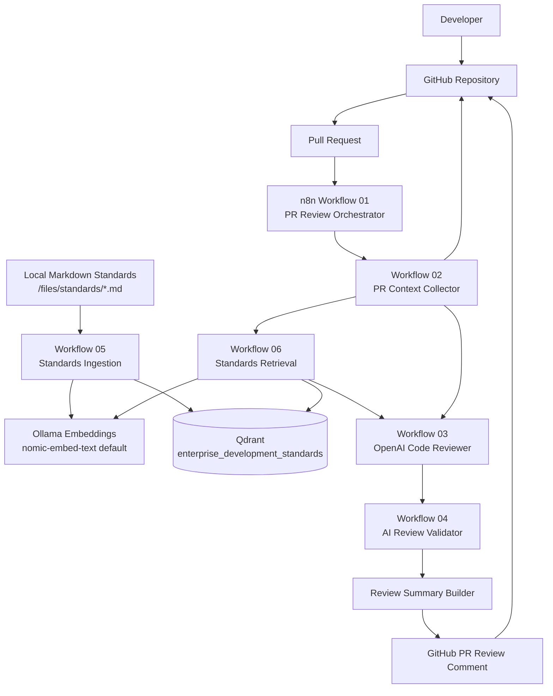
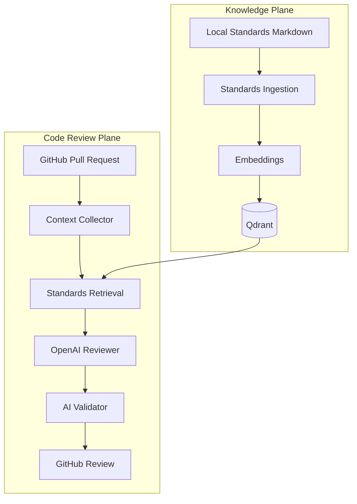
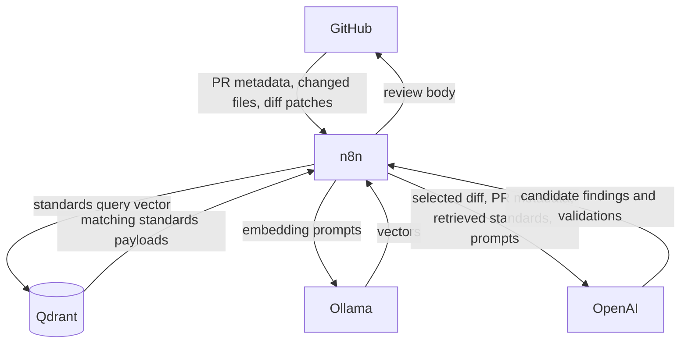
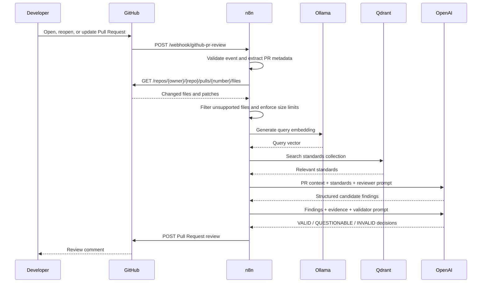
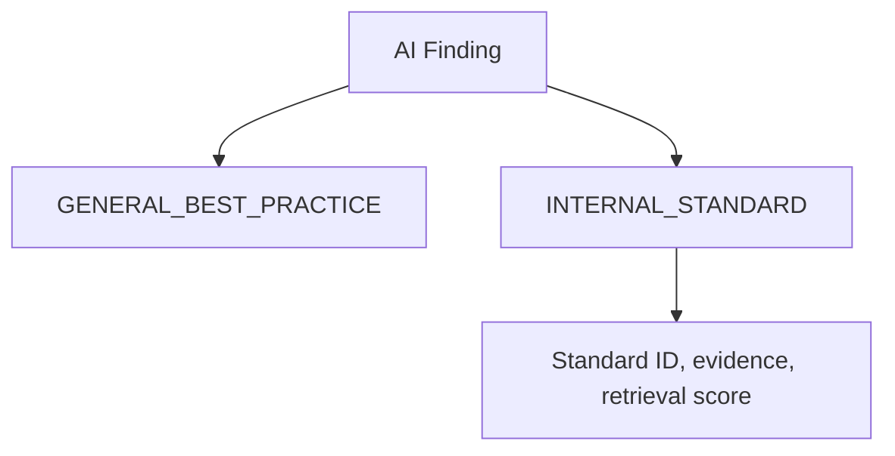
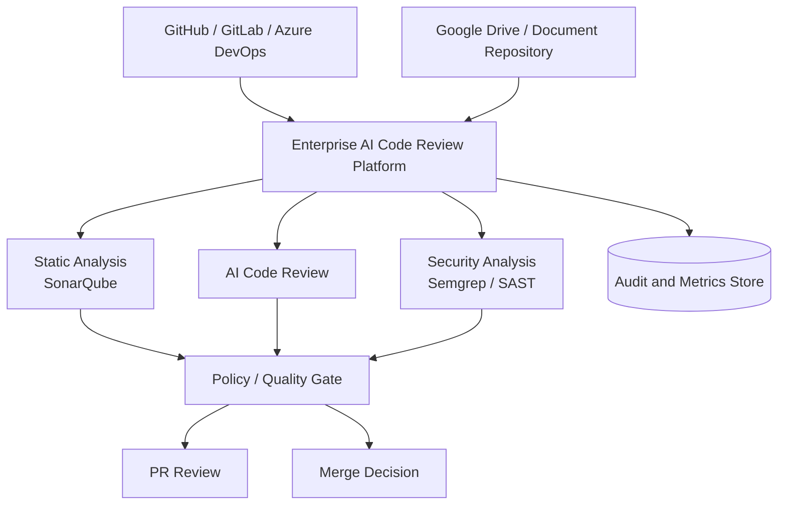

# Enterprise AI Code Review Agent

Enterprise AI Code Review Agent is a proof of concept for AI-assisted Pull Request review using n8n, GitHub, OpenAI, Ollama embeddings, Qdrant, and repository-managed development standards.

The implemented repository demonstrates this flow:

```text
Developer
    ↓
GitHub Pull Request
    ↓
n8n
    ↓
PR Diff / Code Context
    ↓
Retrieve Relevant Enterprise Development Standards
    ↓
OpenAI Code Review
    ↓
AI Finding Validation
    ↓
Evidence-backed Review
    ↓
GitHub Pull Request
```

**The LLM is not the source of organizational policy.** Internal development standards remain authoritative enterprise artifacts. The AI model receives relevant standards as context and reasons about whether changed code complies with them.

## Table of Contents

- [Implementation Status](#implementation-status)
- [Problem Being Solved](#problem-being-solved)
- [Project Objectives](#project-objectives)
- [Current Architecture](#current-architecture)
- [Knowledge Plane](#knowledge-plane)
- [Code Review Plane](#code-review-plane)
- [Key Architecture Decisions](#key-architecture-decisions)
- [Trust Boundaries and Data Flow](#trust-boundaries-and-data-flow)
- [Pull Request Review Sequence](#pull-request-review-sequence)
- [Technology Stack](#technology-stack)
- [Project Structure](#project-structure)
- [n8n Workflows](#n8n-workflows)
- [Standards Ingestion Workflow](#standards-ingestion-workflow)
- [Internal Development Standard Format](#internal-development-standard-format)
- [Qdrant Data Model](#qdrant-data-model)
- [Retrieval-Augmented Generation](#retrieval-augmented-generation-rag)
- [AI Code Reviewer](#ai-code-reviewer)
- [Internal Standard vs General Best Practice](#internal-standard-vs-general-best-practice)
- [Reviewer and Validator Pattern](#reviewer-and-validator-pattern)
- [Evidence and Traceability](#evidence-and-traceability)
- [Prerequisites](#prerequisites)
- [Environment Configuration](#environment-configuration)
- [n8n Credentials](#n8n-credentials)
- [Installation and Setup](#installation-and-setup)
- [GitHub Setup](#github-setup)
- [Testing the POC](#testing-the-poc)
- [Failure and Degraded-Mode Behaviour](#failure-and-degraded-mode-behaviour)
- [Security and Enterprise Considerations](#security-and-enterprise-considerations)
- [What This POC Is Not](#what-this-poc-is-not)
- [What the POC Demonstrates](#what-the-poc-demonstrates)
- [Current Scope and Limitations](#current-scope-and-limitations)
- [Future Architecture](#future-architecture)
- [Architectural Principles](#architectural-principles)

## Implementation Status

This README is based on the files currently present in this repository. The implementation includes six n8n workflow JSON files and six Markdown demo standards files. The workflows are exported with `active: false` and contain placeholder workflow IDs such as `UPDATE_AFTER_IMPORT_02_PR_CONTEXT_COLLECTOR`, which must be updated after import.

No `docker-compose.yml`, `.env.example`, Docker directory, examples directory, Google Drive workflow, or automated test suite is present in this repository. Google Drive is therefore not implemented in the checked-in workflows. Standards ingestion currently reads local Markdown files from `/files/standards` inside the n8n execution environment.

## Problem Being Solved

Traditional static-analysis tools are effective at deterministic checks such as syntax problems, known vulnerabilities, code smells, duplication, complexity, and known insecure patterns.

Enterprises also maintain internal engineering standards for Spring Boot, APIs, security, integration, logging, observability, OpenShift, and architecture. These standards often live in documentation and rely on engineers remembering them during review.

This POC explores whether:

```text
Generative AI
+
RAG
+
Enterprise Development Standards
+
Pull Request Context
```

can augment software engineering review. It does not replace static analysis or human review.

## Project Objectives

Implemented and verified from repository:

- Review GitHub Pull Request events for `opened`, `reopened`, and `synchronize`.
- Retrieve changed files and diff patches from GitHub.
- Filter ignored, binary, generated, unsupported, and oversized changes.
- Ingest local Markdown standards into Qdrant using Ollama embeddings.
- Retrieve relevant standards from Qdrant using semantic search.
- Send PR context and retrieved standards to OpenAI for structured review.
- Run a second OpenAI validation pass over candidate findings.
- Publish a Pull Request review comment through the GitHub API.
- Distinguish `INTERNAL_STANDARD` from `GENERAL_BEST_PRACTICE` findings in the review schema.

Implemented but validation/testing status unknown:

- End-to-end execution in a live n8n instance.
- Qdrant and Ollama connectivity in the target runtime.
- GitHub webhook delivery and review publishing.
- OpenAI response quality against real Pull Requests.

Planned / Future:

- Google Drive standards ingestion.
- Dockerized local infrastructure.
- `.env.example`.
- Deterministic test harness and evaluation data.
- Static-analysis integration and quality gates.

## Current Architecture



## Knowledge Plane

Implemented knowledge ingestion:

```text
Local Markdown files
      ↓
n8n Standards Ingestion
      ↓
Metadata Extraction
      ↓
Chunking
      ↓
Ollama Embedding Generation
      ↓
Qdrant
```

This plane is separated from runtime PR review so standards can be embedded independently of PR execution, reused across reviews, and retrieved without repeatedly processing every standards document.

Google Drive is not implemented in the current workflows. If standards are maintained in Google Drive, a future ingestion workflow would need to list, export, and normalize those documents before the existing chunking and embedding steps.

## Code Review Plane

Implemented review flow:

```text
GitHub Pull Request
       ↓
n8n Webhook
       ↓
PR Context Collector
       ↓
Changed Files / Diff
       ↓
Standards Retrieval
       ↓
OpenAI Reviewer
       ↓
AI Validator
       ↓
Review Formatter
       ↓
GitHub Review
```

The collector retrieves changed files through the GitHub API and keeps only supported text patches. Retrieval builds a semantic query from changed languages, filenames, and diff snippets. The reviewer generates candidate findings. The validator classifies findings as `VALID`, `QUESTIONABLE`, or `INVALID`. The formatter publishes only non-invalid findings that meet the confidence threshold.



## Key Architecture Decisions

| Decision | Implemented Choice | Reason |
|---|---|---|
| Orchestration | n8n workflows | Coordinates webhook handling, API calls, child workflows, and formatting. |
| Source control | GitHub | PR lifecycle and changed-file context are retrieved through GitHub API endpoints. |
| Standards source | Local Markdown files under `/files/standards` | Implemented ingestion source; repository contains demo standards in `standards/`. |
| Vector database | Qdrant | Stores embedded standards chunks and supports similarity search. |
| Embeddings | Ollama `/api/embeddings`, default `nomic-embed-text` | Converts standards and PR queries into vectors. |
| Vector dimensions | Default `768` | Used when creating the Qdrant collection. |
| Distance metric | Cosine | Configured in `05 - Standards Ingestion`. |
| AI reasoning | OpenAI Chat Completions API | Used for reviewer and validator workflows. |
| Source context | GitHub PR file patches | Limits review input to changed files and diffs rather than entire repositories. |
| Finding validation | Separate validator workflow | Attempts to reduce unsupported findings before publication. |

## Trust Boundaries and Data Flow



Code context leaves GitHub when n8n calls the changed-files endpoint. n8n processes metadata, file names, additions, deletions, and patch text. Qdrant stores standards vectors and payload metadata, not PR code. OpenAI receives PR metadata, selected diff content, retrieved internal standards, reviewer instructions, and validator instructions. Internal standards are sent to OpenAI when retrieval succeeds. Credentials are referenced through n8n environment variables. The final review body is written back to GitHub.

No component should be assumed internally hosted unless the deployment provides that control. This repository does not include hosting configuration.

## Pull Request Review Sequence



## Technology Stack

| Technology | Role |
|---|---|
| n8n | Workflow orchestration and integration. |
| GitHub | Pull Request event source, diff source, and review publishing target. |
| OpenAI Chat Completions API | Reviewer and validator model calls. |
| Ollama | Local embedding API endpoint. |
| `nomic-embed-text` | Default embedding model referenced by workflows. |
| Qdrant | Vector database for standards retrieval. |
| Markdown | Standards document format used by current ingestion. |

## Project Structure

```text
n8n-code-reviewer/
├── standards/
│   ├── api-development-standards.md
│   ├── java-development-standards.md
│   ├── observability-standards.md
│   ├── openshift-deployment-standards.md
│   ├── security-standards.md
│   └── springboot-development-standards.md
├── workflows/
│   ├── 01-pr-review-orchestrator.json
│   ├── 02-pr-context-collector.json
│   ├── 03-ai-code-reviewer.json
│   ├── 04-ai-review-validator.json
│   ├── 05-standards-ingestion.json
│   └── 06-standards-retrieval.json
└── README.md
```

## n8n Workflows

| Workflow | Trigger | Purpose | Main Output |
|---|---|---|---|
| `01 - PR Review Orchestrator` | Webhook `POST github-pr-review` | Handles GitHub PR events and coordinates child workflows. | GitHub PR review comment. |
| `02 - PR Context Collector` | Execute Workflow trigger | Retrieves and normalizes changed files. | Filtered PR context. |
| `03 - AI Code Reviewer` | Execute Workflow trigger | Calls OpenAI to generate structured findings. | Candidate findings and summary. |
| `04 - AI Review Validator` | Execute Workflow trigger | Calls OpenAI to validate findings. | Valid and rejected findings. |
| `05 - Standards Ingestion` | Manual trigger | Reads Markdown standards, embeds chunks, upserts Qdrant points. | Qdrant collection points. |
| `06 - Standards Retrieval` | Execute Workflow trigger | Searches Qdrant for relevant standards. | Retrieved standards list. |

### 01 - PR Review Orchestrator

Receives GitHub webhook payloads and accepts only Pull Request actions `opened`, `reopened`, and `synchronize`. It extracts repository owner, repo name, PR number, branches, author, title, description, head SHA, and delivery ID. It then calls workflows 02, 06, 03, and 04. The workflow IDs are placeholders and must be updated after import. It builds a Markdown review summary and publishes it to `POST /repos/{owner}/{repo}/pulls/{pull_number}/reviews` with event `COMMENT`.

### 02 - PR Context Collector

Builds paginated GitHub file requests with `per_page=100` and `GITHUB_FILES_MAX_PAGES` defaulting to `5`. It supports Java, Python, JavaScript, TypeScript, YAML, JSON, SQL, Terraform, Dockerfile, and Helm-related files. It skips common generated, binary, lock, and build paths. Defaults are `50` files, `12000` patch characters per file, and `80000` total patch characters.

### 03 - AI Code Reviewer

Builds an OpenAI Chat Completions request using `OPENAI_CODE_REVIEW_MODEL`, `temperature: 0.1`, and JSON object response format. The prompt allows categories `BUG`, `SECURITY`, `RELIABILITY`, `PERFORMANCE`, `ARCHITECTURE`, `MAINTAINABILITY`, `TESTING`, `ERROR_HANDLING`, `OBSERVABILITY`, and `INTERNAL_STANDARD`. Severities are `CRITICAL`, `HIGH`, `MEDIUM`, `LOW`, and `INFO`. Malformed JSON or OpenAI errors return no findings with `review_available: false`.

### 04 - AI Review Validator

Builds a second OpenAI request using `OPENAI_VALIDATOR_MODEL` or falling back to `OPENAI_CODE_REVIEW_MODEL`. It asks the model to classify each finding as `VALID`, `QUESTIONABLE`, or `INVALID`. Findings are rejected when invalid or below `AI_REVIEW_MIN_CONFIDENCE`, which defaults to `0.80`. If the validator call returns an error, existing findings are marked `QUESTIONABLE` rather than automatically rejected.

### 05 - Standards Ingestion

Creates or updates a Qdrant collection, reads local Markdown standards from `/files/standards`, extracts metadata, chunks standards, calls Ollama for embeddings, builds Qdrant points, and upserts them.

### 06 - Standards Retrieval

Builds a semantic query from changed languages, changed file names, and diff snippets. It embeds that query with Ollama, searches Qdrant with `STANDARDS_TOP_K` defaulting to `8` and `score_threshold: 0.15`, and returns payload fields needed by the reviewer.

## Standards Ingestion Workflow

Actual pipeline:

```text
/files/standards/*.md
       ↓
Load Markdown Documents
       ↓
Extract Version, Standard ID, Title, Category, Technology
       ↓
Chunk content
       ↓
Generate Ollama embeddings
       ↓
Build Qdrant points
       ↓
Upsert to Qdrant
```

Supported format is Markdown only. The workflow splits each document at `##` headings. It extracts IDs matching `ABC-001 — Title` or `ABC-001 - Title`. Defaults are chunk size `1000`, overlap `180`, embedding model `nomic-embed-text`, vector dimension `768`, collection `enterprise_development_standards`, and cosine distance.

Point IDs are assigned as sequential integers starting at `1` for each ingestion run. Re-ingestion overwrites those IDs based on the current ordering of generated chunks. There is no implemented source-file hash, deletion cleanup, Google Drive file ID, or document-level provenance beyond `source_file`.

## Internal Development Standard Format

The demo standards follow this structure:

```markdown
## SB-002 — Outbound HTTP Communication

Category: Integration
Technology: Spring Boot

Outbound HTTP calls must define connection and response timeouts.
```

Recommended production fields:

| Field | Why it matters |
|---|---|
| Standard ID | Stable traceability between findings and policy. |
| Title | Human-readable summary. |
| Category | Groups standards by engineering concern. |
| Technology | Helps retrieval and review relevance. |
| Severity | Supports prioritization; not currently parsed by ingestion. |
| Version | Shows which policy version was embedded. |
| Requirement | Defines the rule the AI should reason against. |
| Rationale | Helps reviewers understand the control objective. |
| Expected implementation | Gives the model concrete compliant patterns. |

## Qdrant Data Model

Stored point payload:

```json
{
  "standard_id": "SB-002",
  "title": "Outbound HTTP Communication",
  "category": "Integration",
  "technology": "Spring Boot",
  "source_file": "springboot-development-standards.md",
  "version": "1.0",
  "content": "..."
}
```

The workflow does not store `finding_source`, `drive_file_id`, `chunk_index`, or severity. Qdrant search returns these payload fields with a similarity `score`, and retrieval formats them for the reviewer.

## Retrieval-Augmented Generation (RAG)

RAG provides the model with selected standards instead of the full policy repository:

```text
PR Code Change
      ↓
Semantic Query
      ↓
Embedding
      ↓
Qdrant Similarity Search
      ↓
Relevant Internal Standards
      ↓
OpenAI Reviewer
```

This reduces irrelevant context and token usage while preserving policy traceability. Actual values: embedding model default `nomic-embed-text`, dimensions default `768`, distance `Cosine`, Top-K default `8`, score threshold `0.15`, chunk size `1000`, and overlap `180`.

## AI Code Reviewer

The reviewer receives:

```text
PR metadata
+
filtered changed files and patches
+
retrieved standards status
+
retrieved standards
+
review instructions
```

Expected finding schema:

```json
{
  "id": "AI-001",
  "finding_source": "INTERNAL_STANDARD",
  "file": "PaymentService.java",
  "line": 84,
  "category": "RELIABILITY",
  "severity": "HIGH",
  "confidence": 0.94,
  "title": "Missing outbound HTTP timeout",
  "description": "The changed WebClient call does not show timeout configuration.",
  "impact": "A downstream outage can hold resources indefinitely.",
  "standard_id": "SB-002",
  "standard_reference": "Outbound HTTP Communication",
  "standard_evidence": "Outbound HTTP calls must define connection and response timeouts.",
  "retrieval_score": 0.72,
  "recommendation": "Use the approved timeout configuration.",
  "suggested_fix": null
}
```

This is a sanitized example matching the implemented schema.

## Internal Standard vs General Best Practice



`GENERAL_BEST_PRACTICE` findings are general engineering recommendations. `INTERNAL_STANDARD` findings must reference supplied standards evidence. A recommendation like "configure an HTTP timeout" is not the same as "this implementation does not comply with `SB-002`." The latter provides organizational traceability.

## Reviewer and Validator Pattern

```text
Changed Code
+
Relevant Standards
        ↓
     Reviewer
        ↓
Candidate Findings
        ↓
     Validator
        ↓
Validated Findings
```

The reviewer performs discovery and reasoning. The validator checks whether each finding is supported by the supplied diff and standards evidence. `VALID` and `QUESTIONABLE` findings can be published if they meet the confidence threshold. `INVALID` findings are rejected. This pattern attempts to reduce unsupported findings; it does not eliminate hallucinations.

## Evidence and Traceability

```text
Pull Request
     ↓
Changed File
     ↓
Changed Code Patch
     ↓
AI Finding
     ↓
Finding Source
     ↓
Internal Standard ID
     ↓
Retrieved Standard Content
     ↓
Retrieval Score
     ↓
AI Confidence
     ↓
Validator Decision
```

Traceability supports developer trust, auditability, AI governance, debugging, false-positive analysis, and policy management.

## Prerequisites

Required by the implemented workflows:

- n8n with support for Webhook, Code, HTTP Request, Execute Workflow, Manual Trigger, and Execute Command nodes.
- GitHub repository and token with Pull Request read and review write access.
- OpenAI API access.
- Ollama reachable by n8n.
- Qdrant reachable by n8n.
- Standards mounted into the n8n runtime at `/files/standards`.

Docker and Docker Compose may be useful, but no Docker setup is included in this repository.

## Environment Configuration

| Variable | Purpose | Example |
|---|---|---|
| `GITHUB_TOKEN` | GitHub API authentication for file retrieval and review publishing. | `<github-token>` |
| `GITHUB_FILES_MAX_PAGES` | Maximum changed-file pages fetched. Default `5`. | `5` |
| `AI_REVIEW_MAX_FILES` | Maximum files reviewed. Default `50`. | `50` |
| `AI_REVIEW_MAX_PATCH_CHARS_PER_FILE` | Per-file patch character limit. Default `12000`. | `12000` |
| `AI_REVIEW_MAX_TOTAL_PATCH_CHARS` | Total patch character limit. Default `80000`. | `80000` |
| `OPENAI_API_KEY` | OpenAI API authentication. | `<openai-api-key>` |
| `OPENAI_CODE_REVIEW_MODEL` | Reviewer model. No default is set in workflow. | `gpt-4.1` |
| `OPENAI_VALIDATOR_MODEL` | Validator model. Falls back to reviewer model. | `gpt-4.1` |
| `AI_REVIEW_MIN_CONFIDENCE` | Minimum finding confidence. Default `0.80`. | `0.80` |
| `QDRANT_URL` | Qdrant base URL. Default `http://qdrant:6333`. | `http://qdrant:6333` |
| `QDRANT_API_KEY` | Qdrant API key. Empty by default. | `<qdrant-api-key>` |
| `QDRANT_STANDARDS_COLLECTION` | Standards collection. Default `enterprise_development_standards`. | `enterprise_development_standards` |
| `OLLAMA_BASE_URL` | Ollama base URL. Default `http://ollama:11434`. | `http://ollama:11434` |
| `OLLAMA_EMBEDDING_MODEL` | Embedding model. Default `nomic-embed-text`. | `nomic-embed-text` |
| `OLLAMA_EMBEDDING_DIMENSIONS` | Qdrant vector size. Default `768`. | `768` |
| `STANDARDS_CHUNK_SIZE` | Standards chunk size. Default `1000`. | `1000` |
| `STANDARDS_CHUNK_OVERLAP` | Standards chunk overlap. Default `180`. | `180` |
| `STANDARDS_TOP_K` | Retrieval result limit. Default `8`. | `8` |

## n8n Credentials

The exported workflows use HTTP headers with environment variables rather than n8n credential objects. No credential IDs are committed.

Required secrets:

- GitHub token in `GITHUB_TOKEN`.
- OpenAI API key in `OPENAI_API_KEY`.
- Qdrant API key in `QDRANT_API_KEY` if the Qdrant deployment requires authentication.

Google Drive OAuth credentials are not used by the current workflows.

## Installation and Setup

1. Clone the repository:

   ```bash
   git clone <repository-url>
   cd n8n-code-reviewer
   ```

2. Configure n8n environment variables using the table above.

3. Make the standards available to n8n at `/files/standards`. For example, mount this repository's `standards/` directory into the n8n container or host path.

4. Start Qdrant and Ollama using your platform's standard deployment process.

5. Pull the embedding model:

   ```bash
   ollama pull nomic-embed-text
   ```

6. Import workflows into n8n in this order:

   ```text
   05 - Standards Ingestion
   06 - Standards Retrieval
   02 - PR Context Collector
   03 - AI Code Reviewer
   04 - AI Review Validator
   01 - PR Review Orchestrator
   ```

7. Update placeholder Execute Workflow IDs in `01 - PR Review Orchestrator` to the imported workflow IDs for workflows 02, 03, 04, and 06.

8. Execute `05 - Standards Ingestion` manually and verify Qdrant contains standards points.

9. Activate `01 - PR Review Orchestrator` after GitHub webhook configuration is complete.

## GitHub Setup

Create a webhook pointing to the production URL for the n8n webhook path:

```text
POST /webhook/github-pr-review
```

Configure the webhook for Pull Request events. The workflow handles `opened`, `reopened`, and `synchronize`. The GitHub token must read PR changed files and create Pull Request reviews.

Webhook signature verification is not implemented in the current workflow and should be added before production use.

## Testing the POC

Test 1 - Standards ingestion: execute workflow 05 and verify the Qdrant collection contains points with `standard_id`, `title`, `category`, `technology`, `source_file`, `version`, and `content`.

Test 2 - Standards retrieval: execute workflow 06 with a sample PR context mentioning a Spring Boot WebClient call without timeout. Expected result is retrieval of `SB-002` if standards were ingested successfully.

Test 3 - AI reviewer: execute workflow 03 with a known problematic diff and retrieved standards. Verify structured JSON findings.

Test 4 - AI validator: execute workflow 04 with one supported and one unsupported finding. Verify `VALID`, `QUESTIONABLE`, or `INVALID` outcomes.

Test 5 - End-to-end PR: open or update a GitHub Pull Request and verify n8n receives the webhook, retrieves files, runs retrieval and review, validates findings, and posts a review comment.

## Failure and Degraded-Mode Behaviour

| Failure Scenario | Current Behaviour | Production Recommendation |
|---|---|---|
| Unsupported GitHub event | Ignored with reason. | Keep behavior and log delivery ID. |
| GitHub unavailable or rate limited | HTTP Request node likely fails workflow. | Add retry, backoff, and explicit rate-limit handling. |
| PR contains unsupported files | Files skipped with reason. | Publish skipped summary when useful. |
| PR too large | Files skipped with `review_limit_exceeded`; review continues on included files. | Add policy for large PR review requirements. |
| Qdrant unavailable | Retrieval formatter can return `standards_available: false` if an error object reaches it. | Add explicit continue-on-fail and alerting. |
| Ollama unavailable | Embedding request likely fails unless node error handling is configured in n8n. | Add retry and degraded general-review mode. |
| OpenAI reviewer error | Parser returns no findings and `review_available: false` if response includes `error`. | Add HTTP error handling and retry. |
| OpenAI malformed JSON | Parser returns no findings. | Keep strict schema and add observability. |
| Validator error | Findings become `QUESTIONABLE` and may publish if confidence threshold passes. | Consider holding findings when validator is unavailable. |
| Validator rejects all findings | Review says no validated findings met threshold. | Keep behavior. |
| Duplicate webhook | No deduplication implemented. | Store delivery IDs or PR SHA review state. |
| Child workflow ID not updated | Orchestrator fails. | Document import checklist and validate IDs. |

## Security and Enterprise Considerations

Production deployments must explicitly decide what source code and internal standards may cross organizational boundaries. The current design sends selected PR diff content and retrieved internal standards to OpenAI.

Security considerations:

- Protect `GITHUB_TOKEN`, `OPENAI_API_KEY`, and `QDRANT_API_KEY`.
- Use least-privilege GitHub permissions.
- Add GitHub webhook signature verification.
- Review whether internal standards may be sent to external model providers.
- Treat code comments and changed files as potential prompt-injection input.
- Avoid logging sensitive source code, standards, tokens, and model prompts.
- Apply Qdrant authentication and network controls.
- Define retention and audit policies for n8n executions.
- Add model/provider approval, monitoring, and cost controls.

## What This POC Is Not

This solution is not intended to replace human code review, SonarQube, SAST, Semgrep, dependency scanning, deterministic static analysis, or engineering ownership. It does not automatically approve code, merge Pull Requests, or make LLM output authoritative. It investigates how AI can augment existing quality controls.

## What the POC Demonstrates

| Capability | Status | Evidence |
|---|---|---|
| Event-driven PR review | Implemented | Webhook in workflow 01. |
| PR context extraction | Implemented | Workflow 02 retrieves GitHub changed files. |
| Local standards ingestion | Implemented | Workflow 05 reads `/files/standards/*.md`. |
| Google Drive integration | Not implemented | No Google Drive nodes or OAuth references. |
| Semantic standards retrieval | Implemented | Workflow 06 embeds query and searches Qdrant. |
| RAG-grounded code review | Implemented | Workflow 03 sends retrieved standards to OpenAI. |
| Structured AI findings | Implemented | Workflow 03 JSON schema and parser. |
| Standard-ID traceability | Implemented | Payload and finding schema include `standard_id`. |
| AI finding validation | Implemented | Workflow 04. |
| GitHub review publishing | Implemented | Workflow 01 posts PR review. |
| End-to-end runtime validation | Implementation status requires validation | No automated test output is included. |

## Current Scope and Limitations

- GitHub only.
- Standards ingestion is local Markdown only.
- No Google Drive integration in current workflows.
- No Docker Compose or reproducible infrastructure files.
- No `.env.example`.
- No webhook signature verification.
- No deduplication for repeated webhook deliveries.
- No deterministic static-analysis integration.
- No automatic quality gate.
- No persisted audit database.
- No automated evaluation suite.
- No false-positive analytics.

## Future Architecture

The following architecture is not currently implemented:



Potential future capabilities include Google Drive ingestion, SonarQube, Semgrep, SAST, dependency scanning, deterministic quality gates, developer feedback tracking, PostgreSQL audit history, dashboards, multiple Git providers, enterprise SSO, AI gateway routing, model observability, cost controls, automated evaluations, and model quality benchmarking.

## Architectural Principles

### AI augments deterministic tooling

AI should complement static analysis rather than replace it.

### Enterprise policy remains external to the LLM

Development standards remain authoritative enterprise artifacts.

### RAG provides targeted context

Retrieve relevant standards rather than blindly providing the entire knowledge base.

### Review changed code

Focus AI analysis on Pull Request changes where practical.

### AI findings require evidence

Enterprise-standard findings should reference relevant policy evidence.

### Do not blindly trust AI output

Use validation and deterministic controls.

### Preserve traceability

Maintain relationships between:

```text
Code
→ Finding
→ Standard
→ Evidence
→ Validation
```

### Humans remain part of the engineering workflow

AI provides engineering assistance; developers and engineering teams remain responsible for code and merge decisions.
